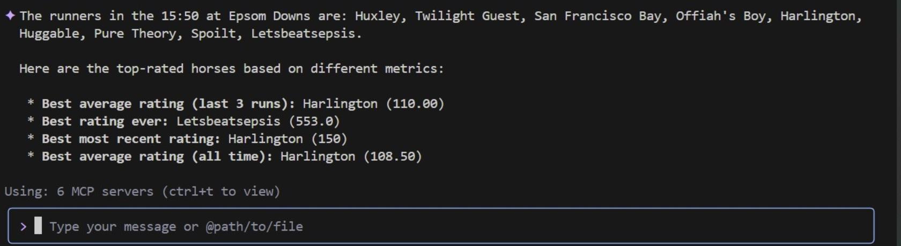

[](https://github.com/TonyKennah/PluckierMCP/actions/workflows/maven.yml)


# MCP Server



This is a Spring Boot application that provides information about horse races and interacts with Google Cloud Storage. It uses Spring AI to expose tool functions for an AI agent and exposes a REST endpoint `/info` to retrieve race information from a JSON file stored in a GCS bucket.

## Technology Stack

Simple code but all about the information.

*   Spring Framework
*   Java 17
*   Spring Boot 3.5.4
*   Spring AI
*   Google Cloud Storage
*   Maven

## Prerequisites

*   Java Development Kit (JDK) 17 or later.
*   Apache Maven.
*   Access to Google Cloud Storage. You must be authenticated, for example by running `gcloud auth application-default login`.

## Configuration

The application is configured to read race data from a JSON file located in a Google Cloud Storage bucket.

## Building the Project

You can build the project using the Maven wrapper:

```sh
./mvnw clean install
```

## Running the Application

To run the application, use the Spring Boot Maven plugin:

```sh
./mvnw spring-boot:run
```

The server will start on `http://localhost:8080`.


# Code Description
- 1. McpServerApplication.java (The Application Entry Point)
What it does: This is the heart of your application. The main method in this class is what you run to start the entire server. The @SpringBootApplication annotation kicks off a lot of magic, including starting a web server, scanning for other components (like your endpoints and services), and configuring them automatically. It also uses @EnableCaching to turn on the caching feature you're using.
Why it's required: Without this class, your application is just a collection of files; it wouldn't know how to start or run. It's the main bootstrap class.
- 2. GCSReader.java (The Data Source Connector)
What it does: This class's only job is to connect to Google Cloud Storage (GCS) and fetch your race data file. The @Cacheable("raceData") annotation is critical here; it ensures that the application only reads the file from the cloud once. After the first read, the data is stored in memory (cached), making all subsequent requests for the data extremely fast.
Why it's required: This is the sole provider of data for your entire application. Without it, RacesInfo would have no information to analyze or serve.
- 3. RacesInfo.java (The Brains of the Operation)
What it does: This is your primary service or "business logic" class. It takes the raw JSON data from GCSReader and contains all the methods to make sense of it (e.g., getNapOfTheDay, getBestEverRated, getAllRunners). The @Tool annotation on each method is what exposes it to the Spring AI framework, allowing the AI to intelligently call these functions to answer questions.
Why it's required: This class contains all the core functionality. Both the AI and the REST endpoints rely entirely on the methods in this class to get information.
- 4. ReaderEndpoint.java (The Public Web API)
What it does: This class creates the standard REST API for your application. It uses @RestController and @GetMapping to expose the methods from RacesInfo as simple web URLs (like /meetings or /next-race). This allows other programs or simple web pages to get data from your application without needing to interact with the AI.
Why it's required: This provides a direct, non-AI way to access your application's logic. It's the bridge between the web and your RacesInfo service.
- 5. WebSocketLogAppender.java (The Live Log Streamer)
What it does: This is a custom piece of the logging framework (Logback). Its purpose is to intercept every log message generated by your application (logger.info(...), etc.) and send a copy of it over a WebSocket to your browser. This is what powers the real-time log view on your logs.html page. It even includes logic to cache logs that happen at the very start of the application, before the WebSocket connection is ready.
Why it's required: This class is essential for the live logging feature. If you removed it, you would no longer see log messages appearing in your web browser.
- 6. WebSocketLogAppenderConfig.java (The Logging "Glue")
What it does: This small but vital class solves a tricky startup problem. The logging system starts very early, before the rest of the application (like the WebSocket messaging system) is ready. This class waits for the ContextRefreshedEvent, which signals that the application is fully started. It then safely connects the WebSocketLogAppender to the messaging system, allowing it to start sending logs.
Why it's required: It prevents a "circular reference" crash on startup. It safely links the logging system to the web system at the correct time.

## Usage

### REST API

The application provides several REST endpoints to test the data retrieval logic that is exposed to the AI agent.

*   **GET /info**

    Retrieves the entire content of the raw `sample_races.json` file.

    **Example using cURL:**
    ```sh
    curl http://localhost:8080/info
    ```

*   **GET /meetings**

    Retrieves all unique meeting place names.

    **Example using cURL:**
    ```sh
    curl http://localhost:8080/meetings
    ```

*   **GET /all-times?place={place}**

    Retrieves all race times for a given meeting place.

    **Example using cURL:**
    ```sh
    curl "http://localhost:8080/all-times?place=Ascot"
    ```

*   **GET /all-runners?time={time}&place={place}**

    Retrieves all runners for a specific race.

    **Example using cURL:**
    ```sh
    curl "http://localhost:8080/all-runners?time=13:30&place=Ascot"
    ```

*   **GET /top-rated?time={time}&place={place}**

    Retrieves the horse with the highest single rating from any past race for a specific race.

    **Example using cURL:**
    ```sh
    curl "http://localhost:8080/top-rated?time=14:05&place=Ascot"
    ```

*   **GET /best-average-rated?time={time}&place={place}**

    Retrieves the horse with the best average rating for a specific race.

    **Example using cURL:**
    ```sh
    curl "http://localhost:8080/best-average-rated?time=13:30&place=Ascot"
    ```

*   **GET /best-most-recent-rated?time={time}&place={place}**

    Retrieves the horse with the highest rating from its most recent race.

    **Example using cURL:**
    ```sh
    curl "http://localhost:8080/best-most-recent-rated?time=13:30&place=Ascot"
    ```

### Spring AI Tools

The `RacesInfo` class is annotated with `@Tool` and provides functions that can be used by a Spring AI-powered agent:
*   `getMeetings()`: Retrieves all unique meeting place names from the race data.
*   `getTopRated(String time, String place)`: Get the top rated horse for a particular race, identified by its time and place. This is the highest single rating from any past race.
*   `getBestAverageRated(String time, String place)`: Get the horse with the best average rating for a particular race, identified by its time and place.
*   `getBestMostRecentRated(String time, String place)`: Get the horse with the highest rating from its most recent race, for a particular race identified by its time and place.
*   `getAllRunners(String time, String place)`: Get all the runners for a particular race, identified by its time and place.
*   `getAllTimes(String place)`: Get all the race times for a given meeting place.
*   `getRawRaceData()`: Reads the raw race data file from the configured Google Cloud Storage bucket.
